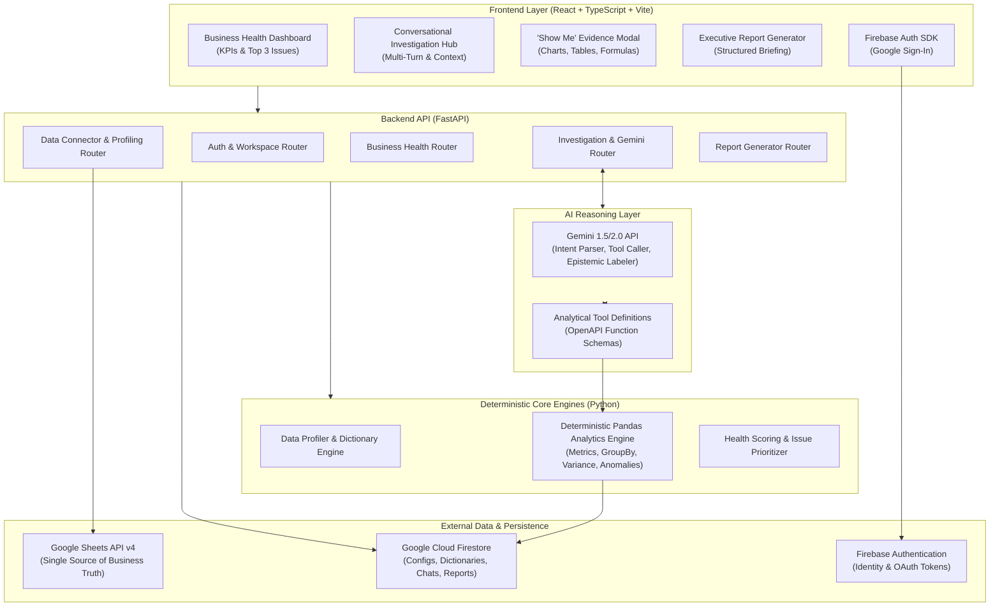
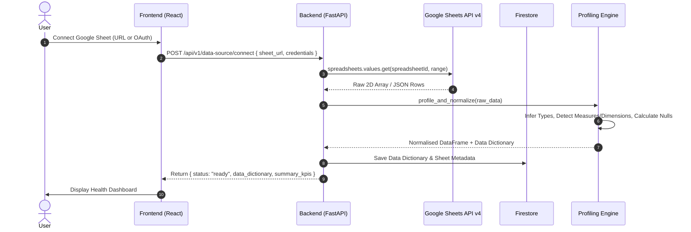
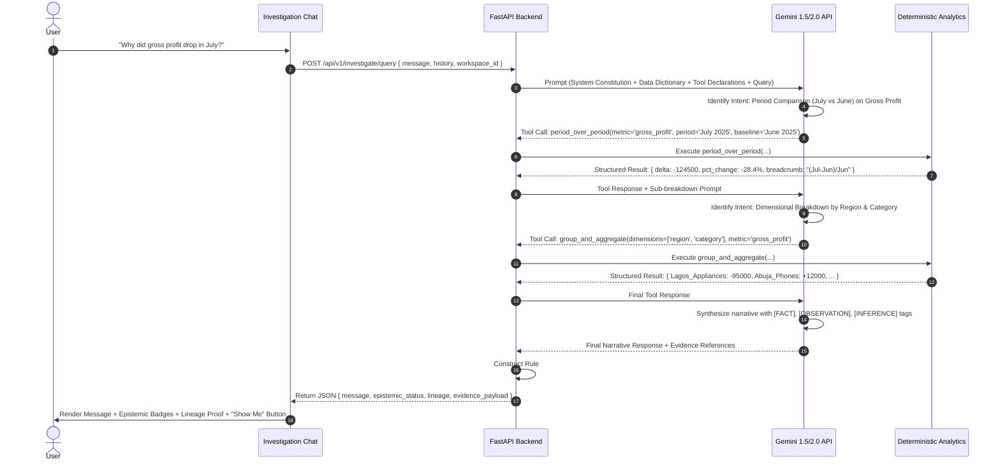

# VESTA — Technical Architecture

> **System Architecture & Engineering Specification**  
> *Target Stack: React + TypeScript + Vite | Python + FastAPI | Gemini API | Firebase*

---

## 1. High-Level System Architecture

VESTA is designed with a strict separation between **Natural Language Understanding / Synthesis (Gemini)** and **Deterministic Computation (Python / Pandas)**. Google Sheets serves as the immutable business source of truth, while Firestore handles application state, workspace configuration, and audit trails.



---

## 2. Frontend Architecture (React + TypeScript + Vite)

### 2.1 Technology & Design Philosophy
* **Core**: React 18+ with TypeScript for robust typing.
* **Build System**: Vite for instant HMR and optimized production bundles.
* **Styling**: Vanilla CSS Design System with curated CSS Custom Properties (CSS variables) for glassmorphism, executive dark/light themes, smooth transitions, and high-density data typography. Avoids Tailwind bloat while guaranteeing bespoke executive aesthetics.
* **State Management**:
  * **Zustand**: For active workspace state, sheet connection status, active filters, and evidence drawer toggles.
  * **TanStack React Query**: For asynchronous data fetching, automatic caching, and background refetches.
* **Visualization Engine**: Lightweight SVG / Recharts wrapper for waterfall, bar, line, and composition charts.

### 2.2 Frontend Module Structure
```
frontend/
├── src/
│   ├── assets/               # Branding, icons, logos
│   ├── components/           # Reusable UI primitives
│   │   ├── common/           # Buttons, modals, cards, badges, tooltips
│   │   ├── charts/           # Dynamic BarChart, LineChart, WaterfallChart, DataTable
│   │   └── epistemic/        # EpistemicTag ([FACT], [INFERENCE], etc.), AnswerabilityBadge
│   ├── features/
│   │   ├── auth/             # Login, Google OAuth button, profile menu
│   │   ├── onboarding/       # Connect Sheet modal, profiling loader, demo selector
│   │   ├── health/           # KPI cards, Top 3 Issues banner, Add/Edit KPI drawer
│   │   ├── investigate/      # Chat feed, message bubbles, tool call indicators, follow-ups
│   │   ├── evidence/         # "Show Me" drawer, formula breadcrumbs, underlying tables
│   │   └── reporting/        # Report preview, printable layout, export triggers
│   ├── hooks/                # useAuth, useWorkspace, useInvestigation, useBusinessHealth
│   ├── services/             # Axios/Fetch API clients for backend endpoints
│   ├── styles/               # design-tokens.css, typography.css, layout.css, components.css
│   ├── types/                # Full TypeScript interfaces (DataModel, API contracts)
│   ├── App.tsx
│   └── main.tsx
```

---

## 3. Backend Architecture (Python + FastAPI)

### 3.1 Framework & Core Modules
* **FastAPI**: Asynchronous Python web framework providing high performance, native Pydantic validation, and automated OpenAPI documentation.
* **Pandas & NumPy**: In-memory vectorised analytical calculations.
* **Google Cloud Client Libraries**: `google-api-python-client` for Google Sheets API v4, `google-cloud-firestore` for database operations, and `google-genai` / `google-generativeai` for Gemini API calls.

### 3.2 Backend Directory Structure
```
backend/
├── app/
│   ├── api/
│   │   ├── v1/
│   │   │   ├── auth.py             # Auth & user session routes (Firebase Google Sign-In)
│   │   │   ├── data_source.py      # Google Sheets connect, sync, profile
│   │   │   ├── health.py           # Business health KPIs, Score & Top 3 issues
│   │   │   ├── investigate.py      # Multi-turn chat & tool orchestration
│   │   │   └── reports.py          # Report compilation & export
│   │   └── deps.py                 # FastAPI dependency injection (Auth, DB)
│   ├── core/
│   │   ├── config.py               # Env vars, Gemini API keys, Firebase secrets
│   │   └── security.py             # JWT & Firebase token verification
│   ├── engines/
│   │   ├── profiler.py             # Column type inference & capability detector (CEO of dataset)
│   │   ├── analytics_engine.py     # Deterministic Pandas analytical functions
│   │   ├── health_engine.py        # KPI scoring, threshold checks, Top 3 prioritizer, Storyline
│   │   └── report_engine.py        # Markdown & structured report synthesizer
│   ├── ai/
│   │   ├── gemini_client.py        # Gemini API integration & model configuration
│   │   ├── prompts.py              # System constitution & epistemic instructions
│   │   └── tools.py                # OpenAPI tool definitions passed to Gemini
│   ├── models/
│   │   ├── domain.py               # Pydantic models for internal domain logic
│   │   ├── schemas.py              # Request / Response DTOs
│   │   └── firestore_models.py     # Firestore document models
│   └── main.py                     # App entry point & middleware configuration
```

---

## 4. Google Sheets Ingestion & Caching Strategy



### 4.1 Ingestion & Normalisation Pipeline
1. **Fetch**: Reads all rows and headers using Google Sheets API v4 with read-only scope (`https://www.googleapis.com/auth/spreadsheets.readonly`).
2. **Sanitize**: Trims whitespace, standardizes column headers to snake_case, strips currency symbols (`$`, `₦`, `€`, `£`) and commas from numeric values.
3. **Type Inference**:
   - Dates: Parses ISO dates, standard formats (`YYYY-MM-DD`, `DD/MM/YYYY`) into `pd.Timestamp`.
   - Numeric / Currency: Coerces to `float64` or `int64`.
   - Categorical / Dimensions: Detects low-cardinality strings as category dimensions.
   - Text / Notes: Preserves high-cardinality strings as qualitative comments.
4. **Session Cache**: Ingested normalized data is kept in-memory (or local session Parquet storage keyed by `workspace_id` and `sheet_hash`) for deterministic sub-10ms query execution.

### 4.2 Data Refresh Architecture & Telemetry
* **Manual Refresh Trigger**: The executive initiates synchronization via the `[🔄 Refresh Data]` button in the top navigation bar.
* **Telemetry & State Tracking**:
  - `Last Synced`: Stored and rendered as an absolute and relative timestamp (e.g. `2026-08-24 14:05 UTC`, `2 mins ago`).
  - `Sync Status`: State machine tracking `READY` (idle/synced), `SYNCING` (fetching/computing), and `ERROR` (failed with retry action).
* **Recalculation Pipeline**:
  $$\text{Manual Refresh} \longrightarrow \text{Re-fetch GSheets} \longrightarrow \text{Re-profile Schema} \longrightarrow \text{Recalculate Health KPIs} \longrightarrow \text{Re-rank Top 3 Issues}$$
* **Post-MVP Deferrals (Explicit)**: Background cron polling, Google Drive real-time webhook listeners, and automatic periodic refresh are deferred to Post-MVP to prevent API quota exhaustion and background concurrency race conditions.

---

## 5. Deterministic Analytics Engine

The LLM **never** performs math. Instead, the Gemini model selects and invokes specific deterministic functions from the Analytics Engine:

```
┌─────────────────────────────────────────────────────────────────────────────┐
│                    DETERMINISTIC ANALYTICS FUNCTION SUITE                   │
├────────────────────────────┬────────────────────────────────────────────────┤
│ Tool Name                  │ Analytical Operation Executed in Pandas        │
├────────────────────────────┼────────────────────────────────────────────────┤
│ `calculate_metric`         │ Sum, mean, median, min, max on a measure       │
│ `group_and_aggregate`      │ Group by 1-3 dimensions with multiple metrics  │
│ `period_over_period`       │ Compares Metric(Period T) vs Metric(Period T-1)│
│ `rank_dimension`           │ Top N / Bottom N dimension values by measure   │
│ `contribution_analysis`    │ Calculates percentage share of total per entity│
│ `variance_to_target`       │ Actual vs Target delta and percentage variance │
│ `detect_anomalies`         │ Identifies values deviating > 2 sigma / baseline│
│ `check_data_sufficiency`   │ Evaluates whether required fields exist in dict│
└────────────────────────────┴────────────────────────────────────────────────┘
```

All functions return structured JSON containing:
* `status`: `SUCCESS` | `ERROR` | `INSUFFICIENT_DATA`
* `calculated_values`: Exact numeric outputs.
* `table_data`: Row-column slice for tabular rendering.
* `chart_spec`: Suggested chart type (bar, line, waterfall) and axis mappings.
* `formula_breadcrumb`: String explaining the mathematical operation performed.

---

## 6. AI Reasoning & Gemini Function Calling Flow



---

## 7. Business Health Engine, Health Score & Issue Prioritization

1. **Explainable Numerical Health Score (0–100) & Contribution Decomposition**:
   - **Individual Metric Health Score ($S_i \in [0, 100]$)**:
     $$S_i = \max\left(0, \min\left(100, 100 \pm \text{Variance \%} \times 2.0\right)\right)$$
   - **Composite Score**: 
     $$\text{Overall Health Score} = \frac{\sum_{i \in \text{Available}} (w_i \times S_i)}{\sum_{i \in \text{Available}} w_i} \in [0, 100]$$
   - **Decomposition**: $\text{Drag Points}_i = (100 - S_i) \times \frac{w_i}{\sum w_k}$
   - **Traffic-Light Bands**: 🟢 `85–100 (GREEN/HEALTHY)`, 🟡 `70–84 (YELLOW/WARNING)`, 🔴 `0–69 (RED/CRITICAL)`
   - **Interactive Triggers**: Each contribution row links directly to an active investigation.

2. **Official Deterministic Issue Prioritization Formula**:
   $$\text{Priority Score} = 0.45 \times \text{Financial Impact} + 0.25 \times \text{Target Deviation} + 0.20 \times \text{Rate of Change} + 0.10 \times \text{Business Criticality}$$
   * **Normalization**: When a component is unavailable, the priority score normalizes across supported components.
   * **Attributes Stored per Issue**: `component_scores`, `component_availability`, `normalized_priority_score`, `ranking_reason`, `financial_impact_label`, `confidence_level`.
   * **Hero vs Drawer Routing**: Top 3 ranked anomalies populate the **Top 3 Issues** executive hero banner; anomalies ranked 4+ populate the **"View More Issues"** drawer.

### 7.1 Business Storyline Synthesis Engine
* **Generation Timing**: Computed deterministically immediately when Business Health loads or refreshes.
* **Deterministic Input Payload**: Evaluates (1) weighted enterprise health status, (2) Top 1 positive variance entity, (3) Top 1 prioritized critical risk, and (4) corresponding investigation intents.
* **Formatting Protocol**: Formatted into a strict **4-bullet executive narrative** ($\le 25$s read time) with zero speculative hallucination.

---

## 8. Google Authentication & Persistence Architecture

### 8.1 Google Authentication Flow
```
User
  ──> Firebase Google Sign-In (Client)
  ──> Google Sheets Authorization (OAuth Scope: ../auth/spreadsheets.readonly)
  ──> Authorized Backend Access (Secure JWT + Sheet Token)
  ──> Google Sheets API v4
  ──> In-Memory Data Profiling & Deterministic Analytics
```

### 8.2 Data Persistence Decision Gate (Lightweight Firestore Scope)
> [!IMPORTANT]
> **Persistence Decision Gate**: Persisting historical investigation trees and Business Health snapshot histories is explicitly gated as an MVP decision. For P0:
> - Active investigations and dynamic Business Health operate in **session memory**.
> - Firestore persistence is scoped strictly to:
>   1. **`users`**: User profile & auth ID.
>   2. **`workspaces`**: Workspace settings & metadata.
>   3. **`data_sources`**: Connected sheet metadata & in-memory profiling reference.
>   4. **`kpi_configs`**: Activated KPI definitions, targets, and display orders.

Business Health calculations and Top 3 Issues are computed on demand / on refresh from the in-memory session cache and Google Sheets data. Firestore persistence is strictly scoped to 5 core functional collections, structured around the **Evidence Trail Tree**:

```mermaid
erDiagram
    WORKSPACES ||--o{ DATA_SOURCES : contains
    WORKSPACES ||--o{ KPI_CONFIGS : defines
    WORKSPACES ||--o{ INVESTIGATIONS : tracks
    INVESTIGATIONS ||--o{ EVIDENCE_NODES : branches
    INVESTIGATIONS ||--o{ REPORTS : generates
    EVIDENCE_NODES ||--o{ ANALYTICAL_RESULTS : references

    WORKSPACES {
        string workspace_id PK
        string user_id
        string name
        timestamp created_at
    }

    DATA_SOURCES {
        string source_id PK
        string sheet_id
        string title
        json data_dictionary
        timestamp last_synced_at
    }

    KPI_CONFIGS {
        string kpi_id PK
        string name
        string category
        float target_value
        string comparison_period
        int display_order
    }

    INVESTIGATIONS {
        string investigation_id PK
        string title
        string root_node_id
        string active_node_id
        timestamp updated_at
    }

    EVIDENCE_NODES {
        string node_id PK
        string investigation_id FK
        string parent_node_id
        string title
        string user_question
        string analytical_result_id
        string epistemic_status
        array evidence_refs
        timestamp created_at
    }

    REPORTS {
        string report_id PK
        string investigation_id
        array evidence_trail_node_ids
        string executive_summary
    }
}
```

### 8.1 Evidence Trail Traversal & State Resumption
* **Tree Branching**: Each user follow-up creates a child node linked via `parent_node_id`.
* **State Resumption**: Clicking any historical node restores the exact analytical result and active filters of that point in time.
* **Report Compilation**: Reports are compiled by traversing selected nodes along the path from root to leaf.
* **Read-Only Reasoning Documentation**: The trail is a persistent audit log of deterministic analysis, distinct from volatile LLM working memory.

---

## 9. Security & Governance Considerations

* **Least-Privilege Google OAuth**: Requests strictly read-only access to Google Sheets (`spreadsheets.readonly`). Tokens are securely handled via Firebase Auth session cookies and never exposed client-side.
* **Data Privacy**: Raw customer PII is never transmitted to Gemini prompt text. Gemini receives only column names, aggregated summaries, and tool outputs.
* **Deterministic Code Isolation**: Pandas operations run strictly through predefined, parameterized analytical functions. No dynamic `eval()` or arbitrary string-to-code execution is permitted.

---

## 10. Deployment Strategy (Hackathon Sprint)

* **Frontend**: Hosted on **Firebase Hosting** or **Vercel** with continuous deployment from `main`.
* **Backend**: Containerized with Docker and deployed to **Google Cloud Run** (auto-scaling, serverless container runtime) with environment secrets managed via Google Secret Manager.
* **Database & Auth**: Managed **Firebase Authentication** and **Google Cloud Firestore**.
